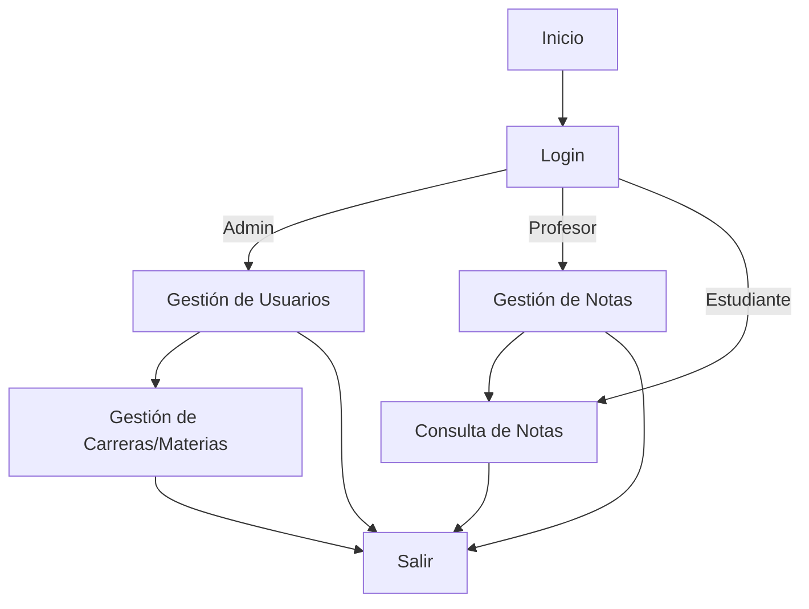

# Sistema de Gestión de Notas Universitarias

## Índice
1. [Descripción](#descripción)
2. [Instalación y Primeros Pasos](#instalación-y-primeros-pasos)
3. [Datos de Ejemplo Incluidos](#datos-de-ejemplo-incluidos)
4. [Credenciales de Ejemplo](#credenciales-de-ejemplo-actualizadas)
5. [Manual de Usuario](#manual-de-usuario)
6. [Diagramas y Flujos](#diagramas-y-flujos)
7. [Uso Rápido](#uso-rápido)
8. [Notas Técnicas](#notas-técnicas)
9. [Estructura de la Base de Datos](#estructura-de-la-base-de-datos)
10. [Autores y Créditos](#autores-y-créditos)

---

## Descripción
Sistema universitario para la gestión de notas, usuarios, materias y carreras. Incluye roles de Administrador, Profesor y Estudiante. Interfaz moderna, validaciones robustas y sincronización automática de datos.

---

## 🚀 Instalación y Primeros Pasos

1. **Clona el repositorio:**
   ```bash
   git clone https://github.com/mat1520/Registro-notas-universitarias-en-Java-y-Sql-Lite
   cd POO-FINAL
   ```
2. **Base de datos:**
   - El archivo `universidad.db` ya está incluido y listo para usar.
   - No es necesario ejecutar scripts de inicialización.
3. **Compila y ejecuta:**
   ```bash
   mvnd javafx:run
   ```

---

## 🗃️ Datos de Ejemplo Incluidos
- **Carreras disponibles:**
  - Ingeniería en Sistemas
  - Ingeniería Mecatrónica
  - Ingeniería Civil
  - (Ver aplicación para lista actualizada)
- **Estudiantes, Profesores y Administradores:**
  - Credenciales actualizadas (ver tabla de ejemplo abajo)
  - Contraseñas seguras y únicas para cada usuario
- **Materias y cursos** distribuidos entre carreras y profesores

---

## 🔑 Credenciales de Ejemplo (Actualizadas)

| Cédula      | Nombre                | Apellido     | Contraseña                | Rol         |
|-------------|-----------------------|--------------|---------------------------|-------------|
| 1752202323  | Gabriela              | Sánchez      | Yx#2K!pm94$@WrLv          | ESTUDIANTE  |
| 1722580873  | Samuel                | Vargas       | Zp@!7WL^X9Kqmr38          | ESTUDIANTE  |
| 1754206744  | Óscar                 | Rodríguez    | K!LpM9g@WzX7r38r          | ADMIN       |
| 1725098373  | Ronnie                | Martínez     | 9m@L!pK9^WzX6gR83         | PROFESOR    |
| 1725098320  | Mauricio              | Rios         | MqLpK^WzX6gR83            | PROFESOR    |
| 1727291823  | Marcela               | Venegas      | pZ7K^LqM@!WzX7gR83        | PROFESOR    |
| ...         | ...                   | ...          | ...                       | ...         |

> **Nota:** Consulta las imágenes o la base de datos para la lista completa de credenciales.

---

## 📘 Manual de Usuario

Ya está disponible el **Manual de Usuario** para el sistema. Puedes consultarlo en el archivo:

- `Manual de Usuario UTIA SISTEMA DE CALIFICACIONES.pdf` (ubicado en la raíz del proyecto)

Este manual contiene instrucciones detalladas para el uso de todas las funcionalidades del sistema, tanto para administradores, profesores como estudiantes.

---

## 📊 Diagramas y Flujos

### Diagrama de Flujo General del Sistema




---

## 📝 Uso Rápido
1. Inicia sesión como **Administrador** para gestionar carreras, materias, usuarios y asignaciones.
2. Inicia sesión como **Profesor** para ver y calificar estudiantes en sus materias.
3. Inicia sesión como **Estudiante** para consultar sus notas y materias.

---

## 💡 Notas Técnicas
- El sistema se adapta a pantalla completa automáticamente.
- Los combos de carrera y materia se actualizan dinámicamente.
- Validaciones robustas para cédula, campos obligatorios y relaciones.
- CRUD completo para usuarios, materias y carreras.

---

## 📂 Estructura de la Base de Datos
- El archivo `universidad.db` contiene toda la información necesaria.
- No es necesario ejecutar scripts adicionales.

---

## 👨‍💻 Autores y Créditos
- Proyecto UTIA – Universidad Tecnológica de Inteligencia Artificial
- Desarrollado por: Ariel Melo, Mateo Yánez, Maria Chango

¿Dudas o sugerencias? ¡Contáctanos! 
arielmelo1520@hotmail.com

## 📝 Cómo Funciona
El sistema de gestión de notas universitarias está diseñado para facilitar la administración de notas, usuarios, materias y carreras. Utiliza JavaFX para la interfaz gráfica y SQLite para el almacenamiento de datos, siguiendo el patrón MVC (Modelo-Vista-Controlador).

### Características Principales
- **Gestión de Usuarios**: Administración de roles (Administrador, Profesor, Estudiante) con validaciones de contraseñas y permisos.
- **Gestión de Materias y Carreras**: Creación, edición y eliminación de materias y carreras, con validaciones para evitar conflictos.
- **Gestión de Notas**: Registro y consulta de notas por parte de profesores y estudiantes.
- **Interfaz Adaptativa**: Diseño responsivo que se adapta a diferentes tamaños de pantalla.

### Tecnologías Utilizadas
- **JavaFX**: Para la interfaz de usuario.
- **SQLite**: Para el almacenamiento de datos.
- **Maven**: Para la gestión de dependencias y compilación del proyecto.

### Patrones de Diseño
- **MVC**: Separación clara entre la lógica de negocio, la interfaz de usuario y el control de datos.
- **DAO**: Acceso a datos a través de objetos de acceso a datos, facilitando la interacción con la base de datos.

### Validaciones y Reglas de Negocio
- Las contraseñas deben tener al menos 12 caracteres.
- No se pueden eliminar carreras con estudiantes o materias asociadas.
- Se realizan validaciones de cédula y campos obligatorios.

### Instalación y Uso
1. Clona el repositorio.
2. Configura la base de datos SQLite con el script de ejemplo si es necesario.
3. Ejecuta la aplicación con JavaFX.

Para más detalles, consulta la documentación técnica incluida en el proyecto.

¿Dudas o sugerencias? ¡Contáctanos! 
arielmelo1520@hotmail.com


(Recuerda que puedes cambiar las contraseñas desde la aplicación si tienes permisos de administrador.)

## Instalación y uso

1. Clona el repositorio
2. Configura la base de datos SQLite con el script de ejemplo si es necesario
3. Ejecuta la aplicación con JavaFX

## Estructura principal
- JavaFX + SQLite
- Patrón MVC
- Usuarios: Admin, Profesor, Estudiante